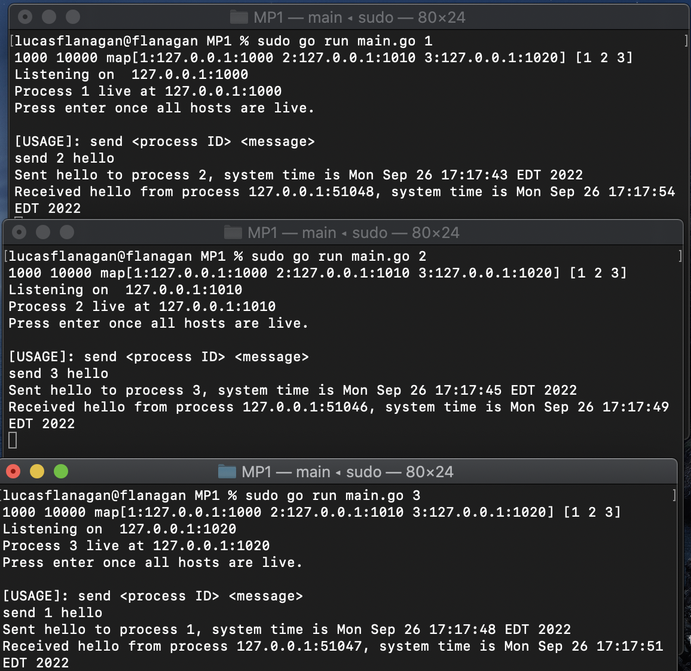

# MP1

This project is an implementation of a simple TCP/IP network in Go. <br>
It consists of a single executable (main.go) that creates a TCP server based on a given configuration (config.txt)<br>
The user may then create TCP clients used to communicate with separate manually-spawned processes. <br>
<br>
Files contained in this repository include:<br>
```
  ..main.go     : the main executable used to run the program<br>
  ..config.txt  : the configuration text file used to specifiy IP & Ports to listen on / connect to.<br>
  ..go.mod      : module path. not utilized due to having only one exectuable currently <br>
  ..README.md   : this file. contains documentation<br>
  ..example.png   : example program execution screenshot with 3 processes<br>
  ```
 ## Usage
  1. Ensure that the IP addresses specified in config.txt have routes. In other words, verify that you are able to ping them.
  2. Spawn each process in a new terminal using: **sudo go run main.go 1**, **sudo go run main.go 2**, **sudo go run main.go 3**
  3. Once all servers have started, press enter (return)
  4. Send a message using: send **\<Process ID\> \<Message\>**

## Important Notes
The following functionality is commented out within main.go:<br>
```
/*
			value := strings.Split(conn.RemoteAddr().String(), ":")[0]
			fmt.Println("Connection was from: ", value)
			var clientId string
			for key := range hosts {
				ip := strings.Split(hosts[key], ":")[0]
				if ip == value {
					clientId = key
				}
			} */
```

**This code would allow the unicast_receive message to display the "from process \<ID\>" value. Unfortunately this does not work when testing locally on my device (MacOS Catalina) as conn.RemoteAddr() will always return the process' specified localhost value. The above code would work for statically allocated IP addresses present on multiple devices communicating within different subnets. It is possible that the functionality is different on other operating systems who have separate techniques for routing localhost addresses. I have chosen instead to display the raw RemoteAddr() value containing the localhost IP and port from which the 'client' is connecting**

## Example


